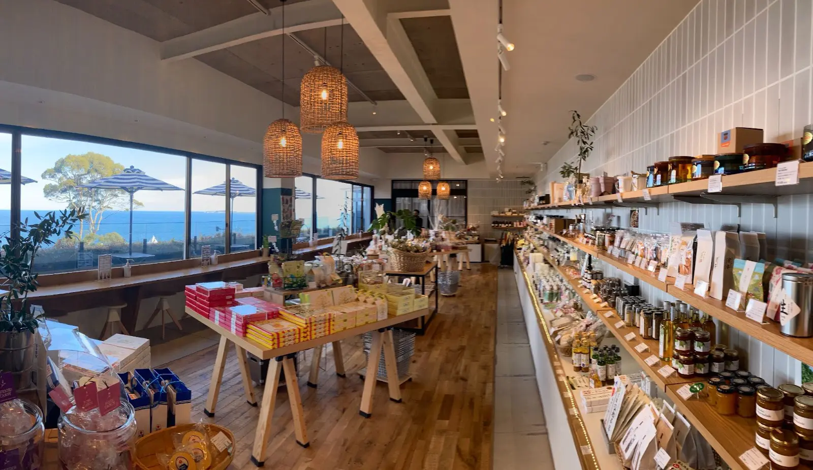

# Discover Your New Favorite Market!

## A Feast for the Eyes and Palate 🌊

Step into a world where culinary delights meet seaside views! This beautiful market is not just a store; it’s an experience. With its warm wooden accents and inviting open layout, you’ll find an array of gourmet goods ready to tantalize your taste buds.

## Breathtaking Views

Nestled alongside stunning ocean vistas, this market features large windows that let in natural light and refreshing ocean breezes. Picture yourself sipping coffee while soaking in the sights—pure bliss!

## Artisan Goodies Galore

From handmade jams to exquisite snacks, the shelves are piled high with artisan products. Each item tells a story, waiting for you to explore its flavors. Don’t forget to grab some local specialties to take home!

## Join the Community

Whether you’re a local or just passing through, this market is the perfect spot to connect with fellow food enthusiasts. Stop by for a chat, exchange recipes, or discover your next favorite dish.

### Don’t Miss Out!

Make sure to visit this hidden gem! Your taste buds will thank you, and your Instagram feed will be glowing with envy-worthy shots. 🍽️✨