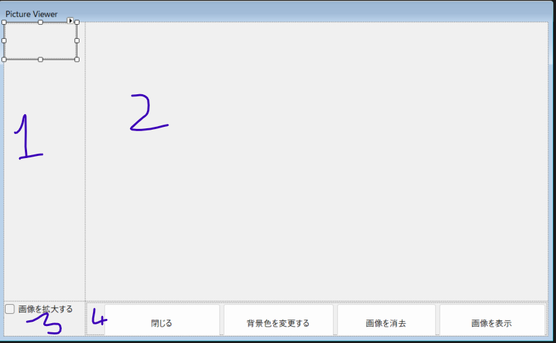

# Unveiling the World of a Picture Viewer: A Deep Dive into User Interface Design

In today's digital realm, where visuals dominate our interactions, the interface we engage with is as crucial as the content itself. Today, we’ll explore a snapshot of a picture viewer application that embodies simplicity and functionality. With its clean layout and intuitive design, this viewer bridges the gap between users and their visual experiences. Let’s take a closer look!

## A Closer Look: The User Interface Components

### The Structure

At first glance, the viewer presents a structured and user-friendly layout. The screen is divided into two main sections: 

1. **The Display Area (Label 2)**: This central region is meant for displaying images. However, in this instance, it appears blank, waiting to exhibit creativity. The absence of clutter allows users to focus solely on the visual content, an essential aspect of effective UI design.

2. **Control Panel (Label 1 & 3-4)**: Situated on the left and bottom parts of the interface, the control panel comprises various functionalities tailored to enhance the user experience. 

### Core Functionalities Unpacked

1. **Image Enlargement (Label 3)**: This feature allows users to zoom in on images, enabling a detailed examination of visual nuances. By empowering users to explore artistic intricacies or fine textual data, this function highlights the viewer’s adaptability to varying user needs.

2. **Closing the Viewer (Label 4)**: A straightforward yet crucial option, this button indicates user control and peace of mind. The simplicity of “Cerrar” (which translates to "close") resonates with the fundamental principle of usability — ensuring users can navigate without confusion.

3. **Background Color Change (Label 1)**: Within this creative tool, users can alter the background color, tailoring their viewing experience to suit personal preference or mood. This personalization element not only enhances user engagement but also promotes a deeper connection with the images.

4. **Image Display/Delete Options**: These controls signify functionality at its finest. Whether displaying an image or removing one entirely, the viewer ensures users have precise control over their visual assets — empowering creativity and productivity.

### The Importance of Design Aesthetics

The layout of the picture viewer reflects an essential element of design: minimalism. By eliminating unnecessary distractions and focusing on core functionalities, the interface is aesthetically pleasing and effective. The gentle blue tones of the background serve to calm the user’s mind, allowing them to immerse themselves fully in the visual experience.

## Conclusion: Bridging Art and Technology

As we dissect this simple yet effective picture viewer, it becomes clear that thoughtful design can significantly enhance user interaction with digital mediums. The marriage of functionality, user control, and aesthetic appeal transforms the mundane task of viewing images into a seamless and enjoyable experience. 

In the fast-paced digital world, applications like this picture viewer remind us of the beauty of simplicity — where powerful tools exist in elegantly crafted packages, waiting for users to unlock their potential. Whether you’re a budding photographer, an artist, or simply someone who appreciates the beauty of visuals, this viewer stands ready to enhance your journey into the world of images.

Let’s embrace the harmony of function and design, for every image has a story waiting to be told!