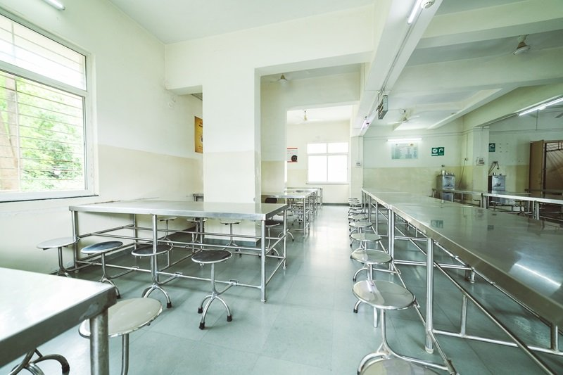

# The Heart of Community: A Closer Look at Cafeteria Spaces

In every institution—from schools to corporate offices—cafeterias play a fundamental role as vibrant hubs of communication and nourishment. As we take a detailed look at an image that encapsulates this essence, we can appreciate the multifaceted functions these spaces fulfill in our daily lives.

## A Minimalist Yet Functional Design

At first glance, the cafeteria depicted in the image exudes a minimalist aesthetic with clean lines and an uncluttered arrangement. The metallic tables reflect a utilitarian design that prioritizes function over form. The stainless steel surfaces are not just for easy cleaning; they symbolize the straightforward, no-nonsense approach to communal dining. The chairs, with their simple yet modern design, invite occupants to sit and engage, fostering a sense of togetherness.

### The Importance of Natural Light

Natural light floods the space, thanks to the large window that stands as a focal point. This abundant illumination not only enhances the ambiance but promotes a sense of well-being. Studies have shown that exposure to natural light can elevate mood, boost productivity, and improve focus—crucial elements in a space meant for relaxation and social interaction. 

### The Sound of Connection

Imagine the soft hum of conversations filling the air, punctuated by laughter and the clinking of cutlery. Cafeterias serve as melting pots where diverse groups converge, sharing food and stories that enrich the community fabric. Though the image may appear quiet and serene, the lively exchanges that typically occur here are what breathe life into the otherwise plain environment. 

## Beyond Just Meals: The Role of Cafeterias in Building Community

Cafeterias are more than just places to grab a quick bite. They are essential spaces where relationships are forged and nurtured. Consider the bonds formed during lunch breaks or casual meetups; these interactions often extend beyond the cafeteria walls, impacting workplace culture and social dynamics.

### A Space for Reflection and Rejuvenation

In today’s fast-paced world, these communal dining areas also offer a refuge—a moment to pause amid the chaos. Whether it's a student taking a break from studying or an employee stepping away from the desk, the cafeteria provides a tranquil setting for reflection. The simplicity of the surroundings encourages a mindful experience, making meals not just about nutrition, but about recharging both body and mind.

## The Future of Cafeteria Design

As we look ahead, the evolution of cafeteria spaces is increasingly focused on sustainability and well-being. Future designs may integrate biophilic elements—think indoor plants and green walls—to foster a connection with nature and enhance mental health. Advances in technology, like contactless payment systems and smart seating arrangements, will also transform how we interact in these communal spaces.

### Conclusion: A Shared Experience

This image, while it may seem straightforward, tells a powerful story about the essential role cafeterias play in our lives. These spaces are not just functional; they are the heart of any community, providing nourishment and a sanctuary for connection and collaboration. Whether it’s through shared meals or meaningful conversations, every visit to a cafeteria is a step toward building a stronger, more united community.

As we embrace the future, let’s continue to appreciate and innovate the spaces where so many of our life’s moments unfold.