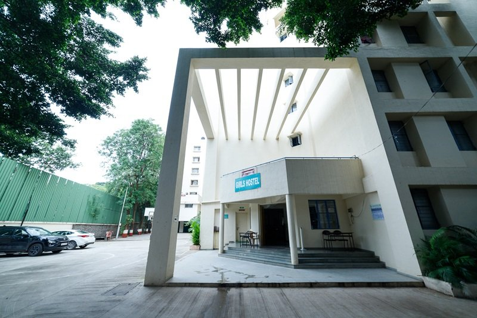

# A Haven of Dreams: The Girls' Hostel

In the heart of an urban sanctuary, the Girls’ Hostel stands as a testament to youthful aspirations and the embrace of sisterhood. Its architectural simplicity intertwines effortlessly with the vibrant greenery surrounding it, where the rustling leaves whisper secrets of dreams yet to be realized. The structure, adorned in soft hues, invites passersby to pause and breathe in the essence of companionship. Here, beneath the watchful gaze of towering trees, laughter mingles with the scent of hope, creating an atmosphere ripe for creativity and growth.

Within these walls, stories unfold—stories of late-night conversations echoing through quiet corridors, of friendships blossoming over shared meals, and of late-night study sessions lit by the warm glow of determination. Each corner, each step, bears witness to the many journeys that converge in this nurturing environment. As the sun sets and casts a golden hue upon the building, the Girls’ Hostel transforms into a beacon of resilience, where aspirations take flight and futures are crafted under the constellation of endless possibilities.