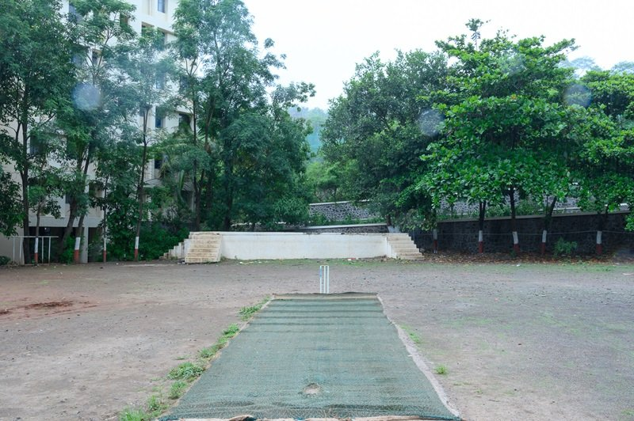

# Embrace of Nature: A Tranquil Cricket Ground

In the heart of the verdant embrace stands a cricket ground, a canvas etched not just with the footprints of athletes but with whispers of laughter and camaraderie. Tall trees arching overhead form a natural cathedral, their leaves shimmering like emeralds under the softened hues of a gray sky. This is not merely an empty space; it is a sanctuary where dreams of competing and friendships bloom amidst the rustling leaves and gentle breezes. 

As the rain begins to weave delicate patterns across the dusty ground, the scent of earth rises to mingle with the crisp, fresh air. The sight of the well-worn pitch beckons with nostalgia, a testament to the many summer afternoons spent honing skills and igniting passions. Each crease and mark tells a story—the thrill of a perfect delivery, the exhilaration of a boundary hit just right. The quiet of the surroundings invites reflection, allowing one to pause and listen to the heartbeat of nature that resonates in this tranquil retreat.

This serene landscape forms not just a backdrop for sport but a vibrant tapestry of life, where the joy of playing harmonizes with the melody of nature. In these moments, as clouds kiss the earth and shadows dance between the trees, it becomes clear that this cricket ground is more than a mere field; it is a celebration of youth, vitality, and the boundless possibilities that lie ahead.