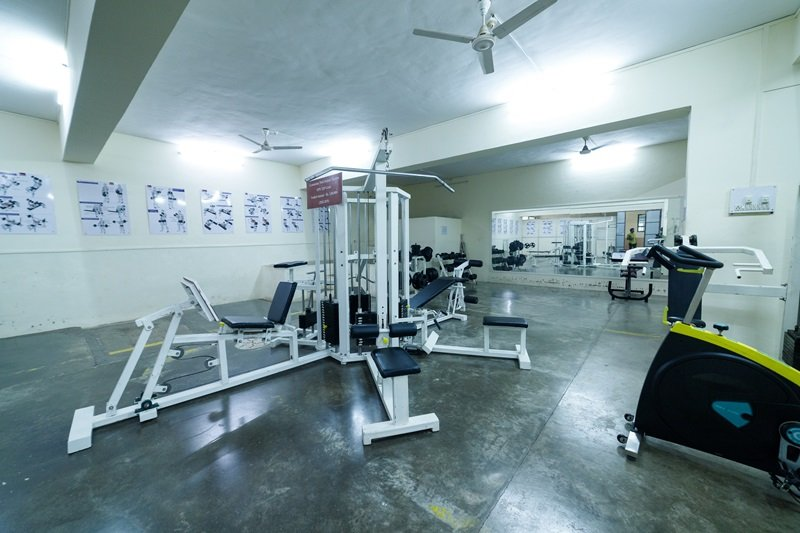

# The Sanctuary of Strength: A Poetic Pause in Fitness

In the hushed embrace of dawn, where ambition mingles with the fresh scent of new beginnings, stands a gym—a sanctuary of strength and resilience. The sleek apparatus glistens under the soft glow of fluorescent lights, a testament to human endeavor. Each machine whispers tales of transformation, of weary bodies sculpted into vessels of vigor. The polished surfaces reflect not only the hustle of countless workouts but also the dreams of those who dare to push beyond their limits.

The rhythmic cadence of spinning wheels and the gentle hum of machinery envelop the air, creating a symphony of dedication. Here, effort and artistry collide, shaping not just muscles but character. Mirrors line the walls like portals to potential, inviting one to gaze into the depths of fortitude. Each drop of sweat tells a story of perseverance, a fleeting moment that captures the essence of the human spirit—unbreakable, unyielding, and resolute.

As the sun climbs higher, illuminating the polished floors, the gym transforms—a canvas where aspirations come alive. Each heartbeat resonates with the affirmations of self-discovery and empowerment. In this sacred space, the journey to strength is not merely physical; it’s a celebration of life itself, where every rep is a stepping stone towards an uncharted horizon of possibility. Welcome to the realm where iron and will intertwine, forging paths into a brighter tomorrow.