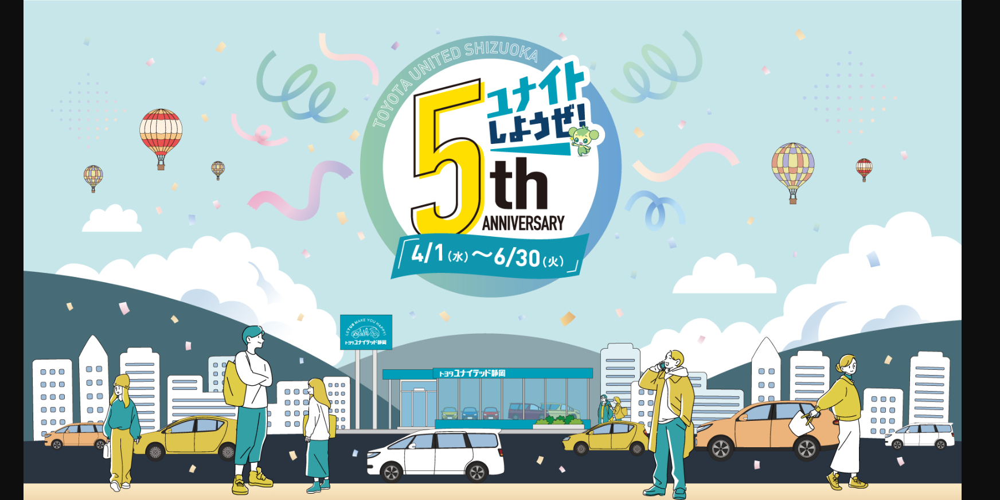

# Celebrating Five Years of Unity and Joy

As the sun rises over the scenic landscape of Shizuoka, the air is alive with a spirit of celebration. This year marks the fifth anniversary of Toyota United Shizuoka, a milestone that echoes the harmony of community, culture, and unwavering passion. Vibrant hot air balloons drift lazily across the azure sky, symbolizing dreams soaring high and connections blossoming below. The streets are adorned with colorful confetti, as if nature herself is joining in the jubilation, breathing life into the festivities that encompass each corner of this lively city.

In this grand tapestry of jubilance, the people of Shizuoka converge, embodying unity in diversity. The scene is painted with laughter, conversation, and the rhythmic pulse of life, where families and friends come together, celebrating the shared journey of growth. The distinctive architecture of the skyline provides a backdrop to this harmonious gathering, a testament to both tradition and modernity, as the community rallies to reflect on the memories forged over the years. From joyous victories to cherished moments, each narrative adds a unique thread to the collective story of Toyota United Shizuoka.

As we revel in this special occasion, let us embrace the spirit of connection that not only commemorates the past but also ignites hope for the future. May this fifth anniversary inspire further adventures, deepen relationships, and enrich the lives of everyone touched by the warmth of Toyota United Shizuoka. Together, we look ahead, ready to grasp the uncharted possibilities awaiting us in the years to come.